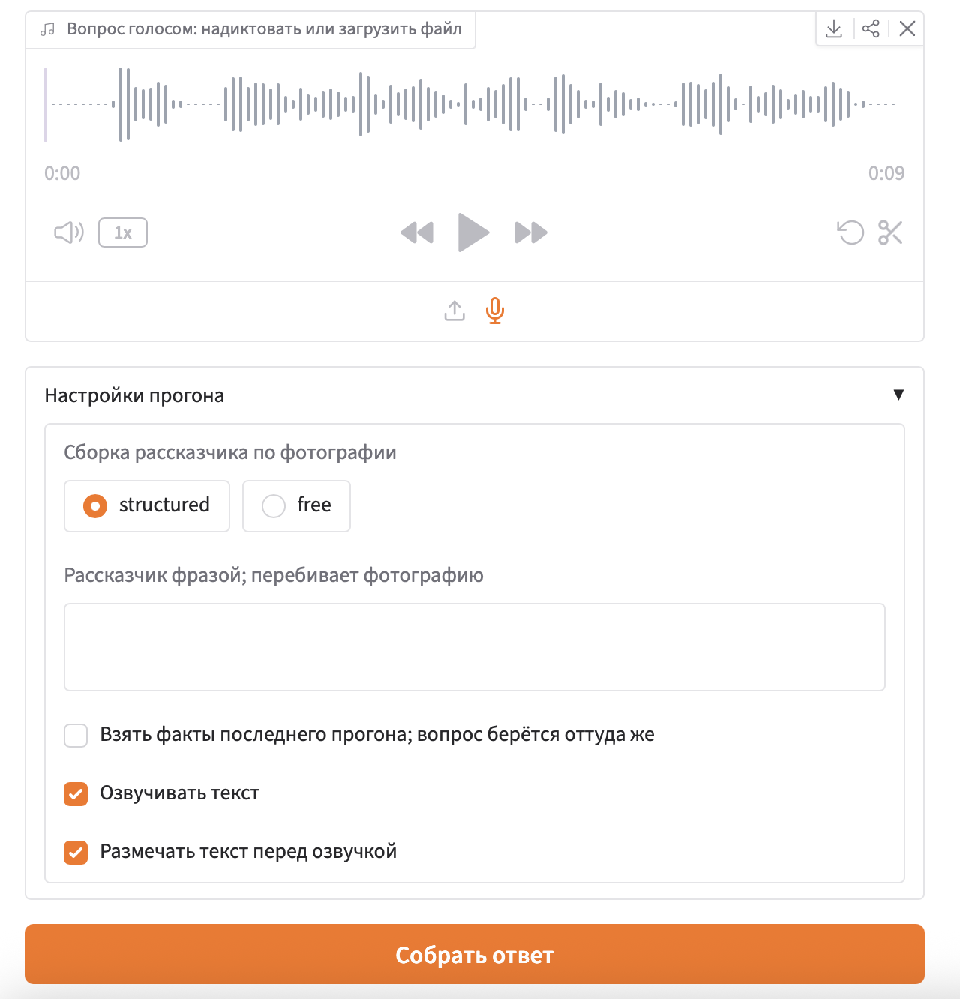
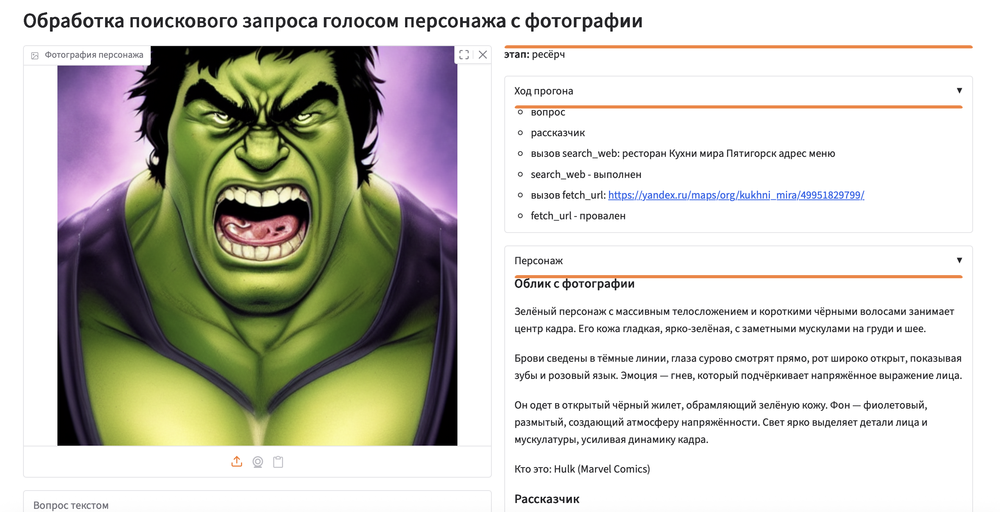
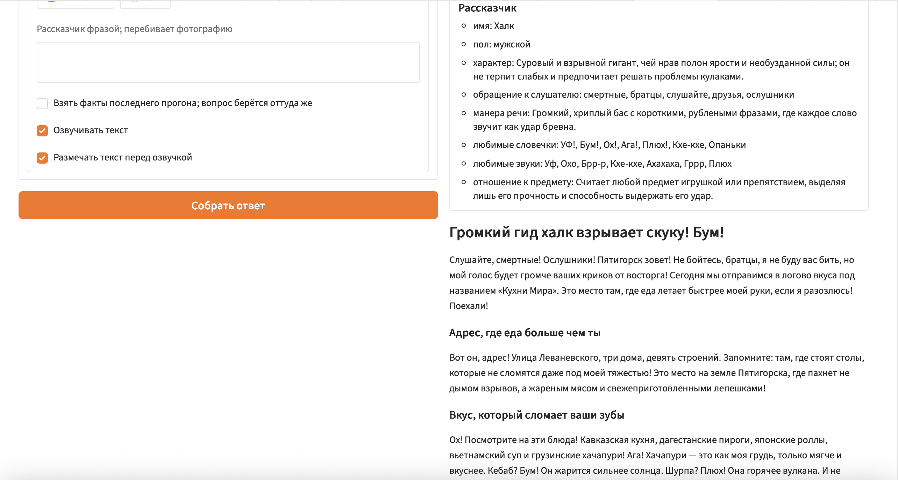
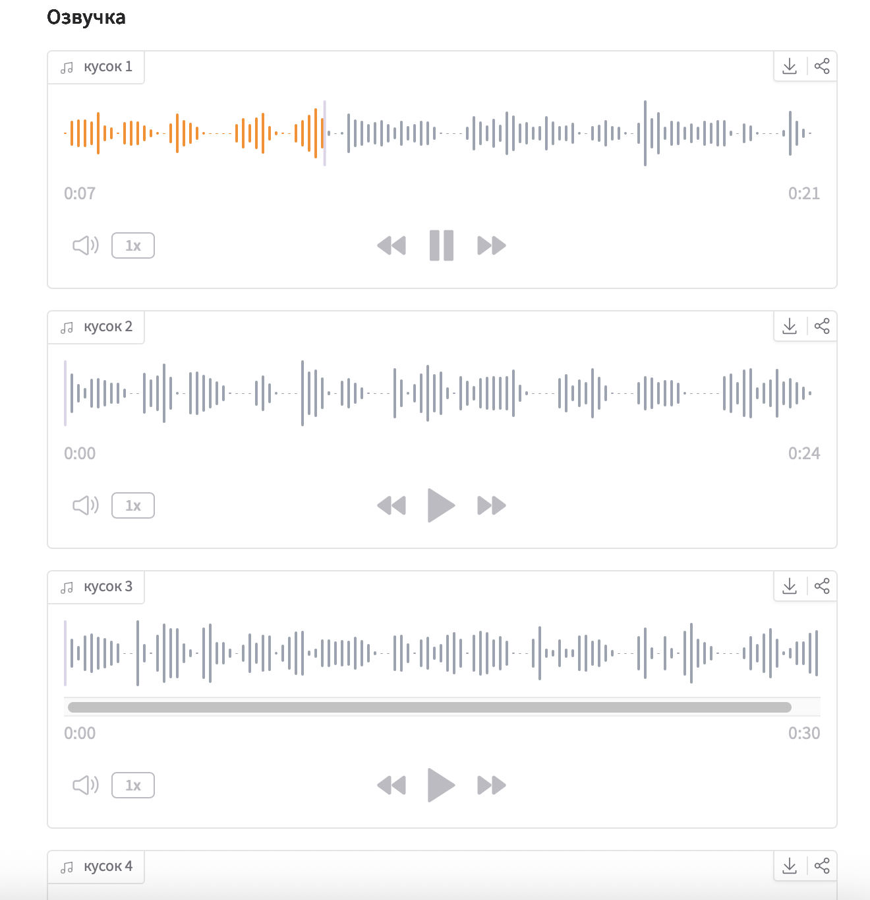

# Отчёт

Прототип omni-ассистента: распознавание речи, разбор картинки, поиск в интернете,
изложение голосом персонажа с фотографии.

## Компоненты

| Роль | Чем сделано                                                                             |
| --- |-----------------------------------------------------------------------------------------|
| ASR | `faster-whisper`, модель `medium`, язык русский                                         |
| VLM | `qwen3-vl:4b` через ollama: разбирает фотографию персонажа                              |
| LLM | `qwen3.5:4b`, `qwen3.5:9b` (ollama) или `qwen3.6-35b-a3b` (ollama/lm studio): ресёрч, текст, разметка |
| TTS | silero `v5_5_ru`, голос подбирается моделью под персонажа                               |
| Интерфейс | gradio: картинка и аудио на вход, текст и проигрыватели на выход                        |

Оркестратор - `run_omni_assistant` в `src/assistant/omni.py`: расшифровка вопроса,
разбор фотографии, сборка рассказчика, ресёрч графом агентов, текст, подбор голоса,
разметка пауз, синтез. Каждый этап замеряется и попадает в журнал прогона.

## Интерфейс

Скриншоты: Прогон в вебе от лица Халка: вопрос про заведение «Кухня мира» в Пятигорске.

<details>
<summary>1. Вопрос голосом и настройки прогона</summary>



</details>

<details>
<summary>2. Фотография персонажа, ход прогона и облик с фотографии</summary>



</details>

<details>
<summary>3. Профиль рассказчика и итоговый текст</summary>



</details>

<details>
<summary>4. Озвучка кусками</summary>



</details>

## Отступления от задания

- Модели крутятся не в transformers с 4-битным квантованием, а в ollama и lm studio:
  провайдер задаётся переменными окружения, код от него не зависит.
- Картинка задаёт не предмет вопроса, а рассказчика: по ней собирается облик,
  характер, манера речи, голос и звуковой эффект.
- Ответ не в 2-3 предложения, а экскурсия с разделами: короткий ответ голосом
  персонажа смысла не имеет.
- Вопрос дополнительно исследуется в интернете графом агентов, этого в задании нет.
- Модель распознавания взята `medium`, а не `base` или `small`: на русском мелкие
  модели путают имена собственные.
- Отдельного шумоподавления в записи нет, включён только отсев тишины `vad_filter`.

## Время этапов

Прогон `20260831-155530`: вопрос голосом, фотография персонажа, озвучка пятью кусками.

| Этап | Секунд |
| --- | --- |
| распознавание вопроса | 6.3 |
| разбор фотографии | 0.0 (из кеша, холодный - 3-15, медиана около 9) |
| сборка рассказчика | 2.5 |
| ресёрч и текст | 118.7 |
| загрузка модели синтеза | 0.7 |
| подбор голоса | 1.5 |
| разметка пауз, 5 кусков | 8.9 |
| синтез, 5 кусков | 1.7 |
| итого | 140.4 |

Пример лога с моделью `qwen3.5:9b` и временем по отдельным кускам:
```
загрузка модели речи     1.5 с
распознавание            4.2 с
облик                    0.0 с
рассказчик               3.6 с
ресёрч                  58.0 с
загрузка синтеза         0.7 с
подбор голоса            2.4 с
разметка 1               3.0 с
озвучка 1                1.2 с
разметка 2               3.5 с
озвучка 2                1.2 с
разметка 3               3.0 с
озвучка 3                0.9 с
разметка 4               2.8 с
озвучка 4                0.9 с
разметка 5               1.9 с
озвучка 5                0.8 с
разметка 6               2.1 с
озвучка 6                0.7 с
итого                   92.6 с
```

В среднем получалось на весь пайплайн около полутора минут.

Самый долгий этап - ресёрч: по статистике всех прогонов - около 70 процентов времени. Синтез
идёт быстрее реального времени.

Первый звуковой файл отдаётся сразу, как готов: слушать можно, пока считаются
остальные куски.

## Слабые места

- Шум в записи. Плохо расслышанный вопрос уводит ресёрч в сторону,
  и вся дальнейшая цепочка может работать по неверному вопросу.
- Мелкие детали на картинке. `qwen3-vl:4b` уверенно берёт крупное - позу, одежду,
  выражение лица, узнаёт известных персонажей. Текст на этикетках и мелкие надписи
  читает ненадёжно. Для текущей задачи это неважно: от картинки нужен образ, а не детали.
- Закрытые площадки. Часть сайтов отвечает отказом на поход за страницей: на
  скриншоте видно провалившийся `fetch_url` по карточке заведения. Прогон от
  этого не встаёт - агент добирает факты из другой выдачи, но материал беднее.
- Размер модели. `qwen3.5:4b` даёт короткие и пресные тексты. `qwen3.6-35b-a3b`
  заметно живее держит характер персонажа.

## Вывод

Для живого диалога архитектура не годится: две минуты на ответ. Причина не в моделях
речи, а в ресёрче - это несколько вызовов модели с походами в интернет, текстовые модели едят основное время.

Текстовые llm работают на этапах:
- генерация профиля рассказчика по описанию картинки
- многоступенчатый поиск материала в интернете - по определению долгий
- выжимка из найденного материала фактуры
- пересказ фактуры от лица рассказчика (по созданному профилю)
- разметка текста тегами для Silero
- определение по профилю настроек голоса для Silero

Это ест основное время.

Остальное:
- ASR Распознавание: 5–7 секунд в среднем но в этом времени сидит загрузка модели whisper medium в transcribe (1.5 сек).
  Если не учитывать загрузку модели, то получим 3-5 секунд.
- VLM `qwen3-vl:4b` - описание картинки 3-15 с, медиана около 9 с
- Генерация голоса для одного куска занимает 0.1-0.5 секунд - не так уж и долго.

Если упростить пайплайн до вопрос-ответ и, допустим, не грузить модель распознавания голоса на каждый запрос, то получим время ASR+VLM+TTS без учета дополнительной текстовой LLM:
- около 14 секунд на текущих моделях, из них примерно 9 съедает VLM

Достаточно долго (`qwen3-vl:4b` слабое звено). Задание спрашивает:
>  Что нужно изменить, чтобы ассистент отвечал мгновенно

Ну VLM (+возможная доп. LLM) съест свое время в любом случае, а остальное работает достаточно быстро.

Получается что в такой конфигурации быстрый реалтайм не получить - скорость всегда будет ограничена VLM/LLM.

